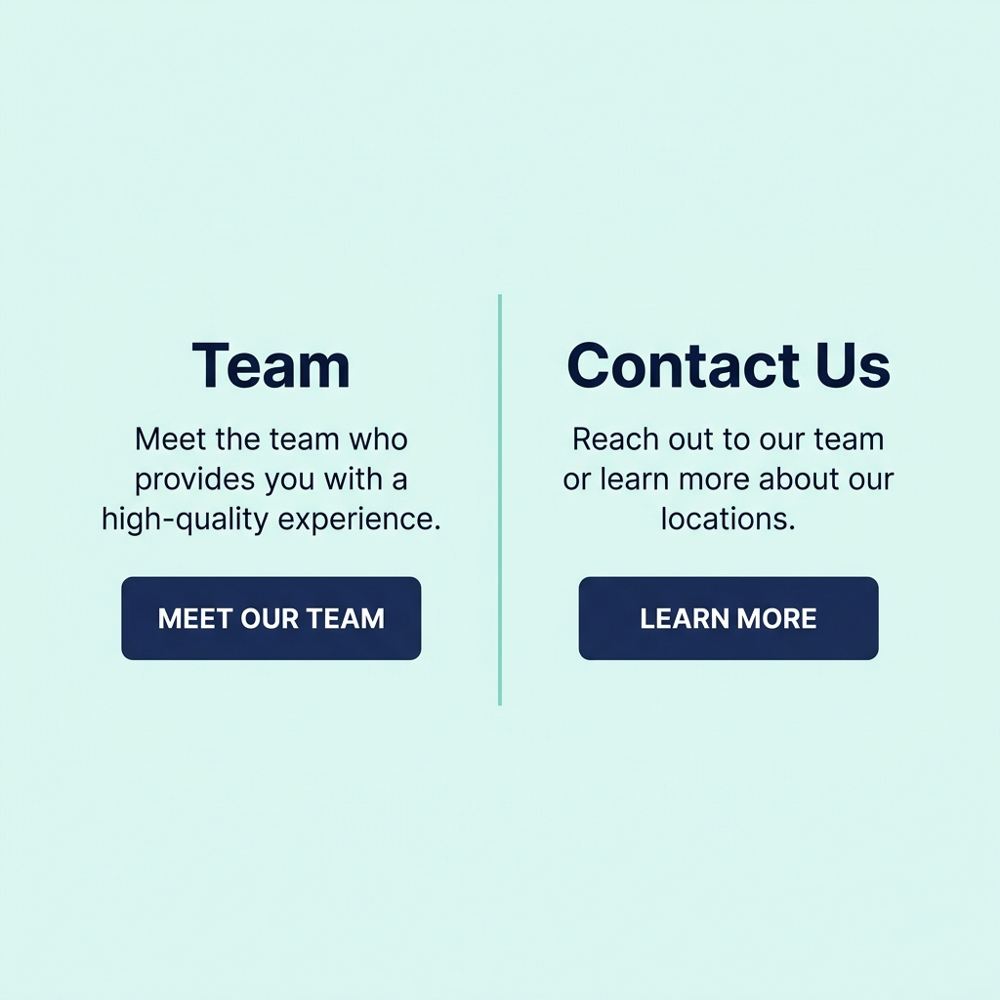

# Two Column CTA Block Component

A premium, modern, and interactive **Two Column CTA Block** component built for the **SI Kids Dentist** website. Designed to showcase dual Call-to-Action pathways (e.g., Team and Contact Us) with clear typographic hierarchy, a central vertical divider accent, and clean CTA button layouts on a light teal background.

---

## 📸 Component Preview



---

## ✨ Features

- **Semantic HTML5:** Built using standard `<section>` and layout tags for optimal accessibility.
- **Centered Vertical Divider:** Connects the columns visually on desktop, transitioning to a horizontal separator on mobile viewports.
- **Micro-Animations:** Interactive button hover transitions, elevation lift, and border/background transitions.
- **Brand Typography:** Direct integration with core custom typography (Poppins/Noto Sans JP).
- **Fully Responsive:** Adapts from side-by-side columns on desktop to stacked, centered elements on mobile.

---

## 📂 File Structure

```text
two-column-cta-block/
├── two-column-cta-block.component.yml # Component properties and definitions
├── two-column-cta-block.twig          # Component Twig structure
├── two-column-cta-block.css           # Responsive styles and micro-animations
└── README.md                          # Documentation
```

---

## 🛠️ Usage & Integration

### 1. File Imports
Ensure the global theme styles (`sipd.css`) are loaded. The component's CSS will load automatically with Single Directory Components.

### 2. Insert Twig Markup
Include the component in your Twig templates using the standard SDC include syntax:

```twig

```

---

## 🎨 Design Customization

The component uses scoped CSS Custom Properties under the `.two-col-cta` selector. You can override these variables to adapt the component's styling:

```css
.two-col-cta {
  --two-col-cta-bg: hsl(175, 54%, 93%);
  --two-col-cta-title-color: #00334F;
  --two-col-cta-text-color: #414549;
  --two-col-cta-divider-color: #39BDB3;
  --two-col-cta-btn-bg: #00334F;
  --two-col-cta-btn-text: #fefefe;
}
```
